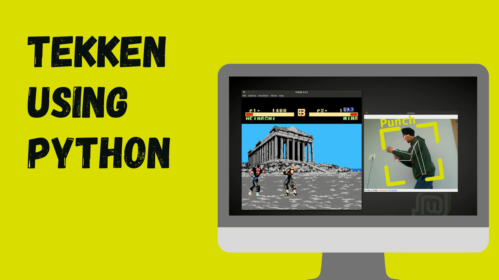

# tekken-python-ml

<h1>Requirements</h1>
<code>pip install mediapipe</code> 
<code>pip install pyautogui</code> 
<code>pip install opencv-python</code> 
<code>pip install numpy</code> 

<h1>How to Run?</h1>
run it with following command   <code>python tekken.py</code>
  <h1>Video</h1>
  video link : https://youtu.be/gRnDUa8LG4o 
  
<h1>Connect with me</h1>
If you have any queries regarding any of the topic I discussed in this video feel free to talk to e using below links: 
facebook : https://m.facebook.com/proogramminghub 
instagram : @programming_hut 
twitter : https://twitter.com/programming_hut 
github : https://github.com/Pawandeep-prog 
discord : https://discord.gg/G5Cunyg 
linkedin : https://www.linkedin.com/in/programminghut 
youtube : https://www.youtube.com/c/programminghutofficial 
